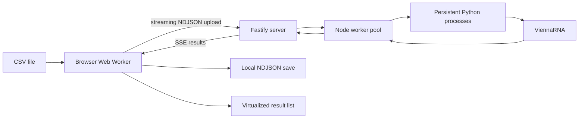

# RNAFold Explorer

RNAFold Explorer is a local, high-throughput interface for predicting and exploring RNA secondary structures. It combines a streaming browser UI, a concurrent Node.js worker pool, persistent Python processes, and the [ViennaRNA](https://github.com/ViennaRNA/ViennaRNA) Python API.

The project is designed to make large batches of RNA folding results usable while they are still being calculated. Results stream into the browser, are saved locally as NDJSON, and are displayed through a virtualized interface that keeps the number of DOM elements small.

> [!IMPORTANT]
> This is a computational research and demonstration tool. Its output is a model-based prediction, not an experimentally verified structure or biological annotation.

## What it predicts

For every RNA sequence, the application calls ViennaRNA's [`RNA.fold()`](https://viennarna.readthedocs.io/en/latest/api_python.html#RNA.fold) function to calculate a minimum-free-energy (MFE) secondary structure. ViennaRNA documents this function as returning a predicted MFE structure and its free energy.

The application reports:

- The normalized RNA sequence
- Sequence length in nucleotides
- Secondary structure in dot-bracket notation
- Predicted minimum free energy in `kcal/mol`
- Every predicted base pair and its positions
- Total base-pair count
- Paired nucleotide count
- Unpaired nucleotide count

Example:

```text
Sequence:  CUACGGCGCGGCGCCCUUGGCGA
Structure: ...........((((...)))).
Energy:    -5.0 kcal/mol
```

In dot-bracket notation:

- `.` means that a nucleotide is unpaired.
- Matching `(` and `)` characters identify paired nucleotides.
- A more negative energy represents a lower predicted free energy under the model; it is not a confidence score.

## What it does not predict

RNAFold Explorer does **not** currently determine:

- What an RNA does biologically
- The RNA's gene, family, or name
- Whether a protein binds to the RNA
- A matching protein or protein sequence
- A three-dimensional molecular structure
- Experimentally confirmed folding
- A prediction confidence score
- Base-pair probabilities or the complete thermodynamic ensemble
- Pseudoknotted structures

It predicts one MFE secondary structure for each supplied sequence.

## Features

### Streaming batch processing

- Accepts CSV input without loading the entire file into memory at once
- Converts CSV records to NDJSON in a browser Web Worker
- Streams NDJSON to the server as it is parsed
- Sends results back immediately using Server-Sent Events (SSE)
- Keeps the HTTP upload and result stream independent
- Writes streamed events to a local NDJSON save file

### Concurrent RNA folding

- Uses a reusable pool of Node.js worker threads
- Starts one persistent Python process per worker
- Avoids launching Python separately for every sequence
- Uses multiple CPU cores, defaulting to one fewer than the available logical CPUs
- Applies backpressure while submitting work
- Enforces a bounded job queue
- Restarts failed workers automatically
- Supports job cancellation and timeouts

### Large-result interface

- Uses [TanStack Virtual](https://tanstack.com/virtual) for variable-height row virtualization
- Creates DOM elements only for results near the visible viewport
- Reuses rows that remain visible
- Measures real row heights after rendering
- Supports large sequences without creating millions of DOM nodes
- Batches visual updates with `requestAnimationFrame()`

### Local workspaces and saved results

- Saves result streams as NDJSON in the browser's Origin Private File System (OPFS)
- Lists saved runs in the sidebar
- Loads saved NDJSON files in a Web Worker
- Loads a save only when it is first opened
- Switches between workspaces while preserving each workspace's scroll position
- Allows inactive calculations to continue in the background
- Provides a **New Project** action that clears the visible workspace and deactivates its virtualizer

### Failure handling

- Cancels server work when the result stream disconnects
- Aborts outstanding jobs during server shutdown
- Terminates persistent Python processes cleanly, with a forced-kill fallback
- Rejects malformed NDJSON and reports the line number while loading saves
- Validates RNAfold output before displaying it
- Rejects invalid sequences returned from the folding layer
- Expires unfinished runs after 10 minutes

## Why it performs well

The project attacks three separate bottlenecks:

1. **File handling:** CSV input and NDJSON output are streamed instead of being copied into one enormous string.
2. **Computation:** a bounded pool distributes sequences across persistent Python/ViennaRNA processes.
3. **Rendering:** the browser retains the result data but renders only the small portion visible on screen.



## Current limits

### File-size limit

The current supported maximum input file size is **2 GB per file**. This is presently a documented support boundary, not a hard server-side check; files larger than 2 GB should not be considered supported.

The application streams file contents, but file size is not the only practical limit. Available RAM, CPU speed, browser storage quota, sequence lengths, result count, and browser implementation can reduce the usable size below 2 GB. Every completed result is currently retained as a JavaScript object in its workspace, so extremely large result sets can still exhaust browser memory even though the DOM is virtualized.

### Other limitations

- Input must be a CSV file with a header row and a `sequence` column.
- `rna_id` or `id` is optional; otherwise the input row number is used.
- Sequences are trimmed, converted to uppercase, and expected to contain only `A`, `C`, `G`, and `U`.
- Concurrent results may arrive in completion order rather than original CSV order. `rowNumber` preserves the source position.
- Each sequence has a default 30-second execution timeout.
- The default waiting queue holds 100 jobs when every worker is busy.
- A run expires after 10 minutes, even if a very large upload still has work remaining.
- Saved projects are tied to the browser origin. Clearing site data may delete them.
- Results are stored locally as NDJSON but are not indexed for random access.
- Virtualization reduces DOM usage; it does not make the in-memory result array constant-sized.
- Only one workspace is visible at a time.
- There is no search, sorting, filtering, progress dashboard, or graphical structure diagram yet.
- There is no user authentication, authorization, database, or multi-user isolation.
- Processing is limited to one machine; there is no distributed queue.
- The current Python path uses `.venv/bin/python`, making the implementation macOS/Linux-oriented.
- The included HTTPS certificate is for local development, not production deployment.
- There is not yet an automated test suite.

## Input format

Only `sequence` is required. Extra CSV columns are allowed and ignored by the current folding pipeline.

```csv
rna_id,sequence
RNA_001,CUACGGCGCGGCGCCCUUGGCGA
RNA_002,GCGCUUAGCGAAAUCGC
```

Quoted fields, commas inside quoted fields, escaped quotes, UTF-8 chunk boundaries, and both LF and CRLF line endings are handled by the browser CSV parser.

## Saved NDJSON format

Each line is an independent JSON message. A save contains lifecycle messages as well as results:

```json
{"type":"ready","id":"run-id"}
{"type":"result","id":"RNA_001","rowNumber":1,"result":{"sequence":"CUACGGCGCGGCGCCCUUGGCGA","length":23,"structure":"...........((((...)))).","energy":-5,"energyUnit":"kcal/mol","basePairs":[{"from":12,"to":22,"fromBase":"C","toBase":"G"},{"from":13,"to":21,"fromBase":"G","toBase":"C"},{"from":14,"to":20,"fromBase":"C","toBase":"G"},{"from":15,"to":19,"fromBase":"C","toBase":"G"}],"basePairCount":4,"pairedNucleotideCount":8,"unpairedNucleotideCount":15}}
{"type":"done","received":1,"completed":1,"failed":0}
```

The loader streams the file and displays messages whose `type` is `result`.

## Requirements

- macOS or a Unix-like environment
- [Node.js](https://nodejs.org/) `24.21.0` (specified by `.nvmrc`)
- Python 3
- The [ViennaRNA Python interface](https://github.com/ViennaRNA/ViennaRNA)
- A modern Chromium-based browser with File System Access, OPFS, Web Workers, Streams, and Server-Sent Events support

## Installation

Clone the repository and enter the project directory:

```bash
git clone <repository-url>
cd RNAinterface
```

Select the project's Node.js version and install dependencies:

```bash
nvm install
nvm use
npm install
```

Create the Python virtual environment expected by the worker processes:

```bash
python3 -m venv .venv
source .venv/bin/activate
python -m pip install --upgrade pip
python -m pip install ViennaRNA
```

Verify the Python interface:

```bash
.venv/bin/python -c "import RNA; print(RNA.fold('CUACGGCGCGGCGCCCUUGGCGA'))"
```

Build the browser copy of TanStack Virtual:

```bash
npm run build:library
```

## Running locally

Start the server from the repository root:

```bash
node app.js
```

Then open:

```text
https://localhost:3002
```

The current server uses a local HTTPS certificate. Your browser may require the certificate to be trusted before opening the application.

## Configuration

The worker pool can be configured with environment variables:

| Variable | Default | Purpose |
| --- | ---: | --- |
| `RNA_WORKER_COUNT` | available CPUs minus one | Number of persistent folding workers |
| `RNA_MAX_QUEUE_SIZE` | `100` | Maximum jobs waiting while all workers are occupied |
| `RNA_JOB_TIMEOUT_MS` | `30000` | Timeout for one sequence in milliseconds |

Example:

```bash
RNA_WORKER_COUNT=4 \
RNA_MAX_QUEUE_SIZE=200 \
RNA_JOB_TIMEOUT_MS=60000 \
node app.js
```

Increasing the worker count can improve throughput, but each worker owns a Python process and consumes CPU and memory. More workers are not always faster once the machine is saturated.

## Using the application

1. Start the server and open the local URL.
2. Select **Upload RNA**.
3. Choose a CSV file containing a `sequence` column.
4. Results appear as soon as individual folds complete.
5. The current run appears in the sidebar and is saved locally as NDJSON.
6. Select another saved run to switch workspaces.
7. Select **New Project** to clear the visible results without deleting saved runs.

A synthetic 100,000-sequence example is included at:

```text
sample data/synthetic_rna_100000.csv
```

## Future work

### Scientific capabilities

- Base-pair probabilities and partition-function calculations
- Centroid and maximum-expected-accuracy structures
- Suboptimal structure exploration
- Ensemble diversity and uncertainty displays
- Optional folding constraints and temperature controls
- Pseudoknot-capable predictors
- Two-dimensional structure visualization
- Comparison of multiple folding algorithms

### Data and interface

- Progress, throughput, ETA, error, and cancellation controls
- Search, filtering, sorting, and result selection
- Export to CSV, JSON, NDJSON, dot-bracket, CT, and common bioinformatics formats
- Input schema validation with an error preview before processing
- Ordered-output mode
- Charts for energy, length, pairing percentage, and GC content
- Indexed, paged results so completed objects do not all remain in RAM
- Save metadata, custom project names, rename, delete, and import/export controls
- Recovery of interrupted calculations

### Scaling and deployment

- Adaptive worker counts based on CPU and memory pressure
- Shared queues using Redis/BullMQ
- Multiple server instances and distributed folding workers
- Durable database-backed run state
- Docker-based installation
- Authentication and multi-user isolation
- Production TLS, rate limits, request-size enforcement, and security hardening
- Automated unit, integration, browser, load, and scientific regression tests

## Project structure

```text
app.js                         Fastify server, SSE, uploads, and run lifecycle
run-rna-fold.js                Bounded Node.js worker pool
workers/rna-fold.worker.js     Persistent Python/ViennaRNA process manager
public/js/index.js             Workspaces and virtualized browser UI
public/js/workers/upload-csv.js CSV streaming, SSE client, saves, NDJSON loader
public/js/library/             Browser-bundled third-party code
views/index.html               Main interface and result-row template
public/css/index.css           Application styling
sample data/                   Synthetic demonstration input
```

## Technology

- [ViennaRNA](https://github.com/ViennaRNA/ViennaRNA)
- [Node.js worker threads](https://nodejs.org/api/worker_threads.html)
- [Fastify](https://fastify.dev/)
- [TanStack Virtual](https://tanstack.com/virtual)
- Browser Web Workers, Streams, SSE, File System Access, and OPFS

## Scientific and operational caution

RNA secondary-structure prediction is an approximation based on a thermodynamic model and its assumptions. Predictions can differ from structures adopted in living systems or laboratory conditions. Do not treat the output as clinical evidence, experimental confirmation, or a replacement for expert scientific analysis.

This server listens on all network interfaces and currently has no authentication. Keep it on a trusted network and do not expose it directly to the public internet.
